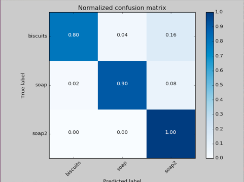
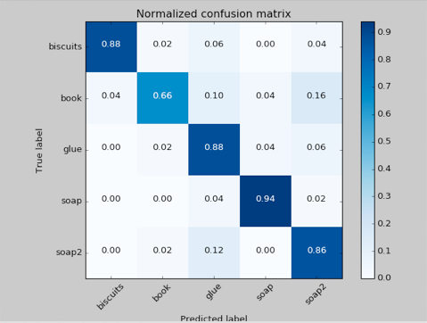
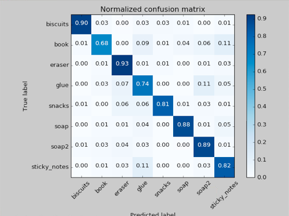
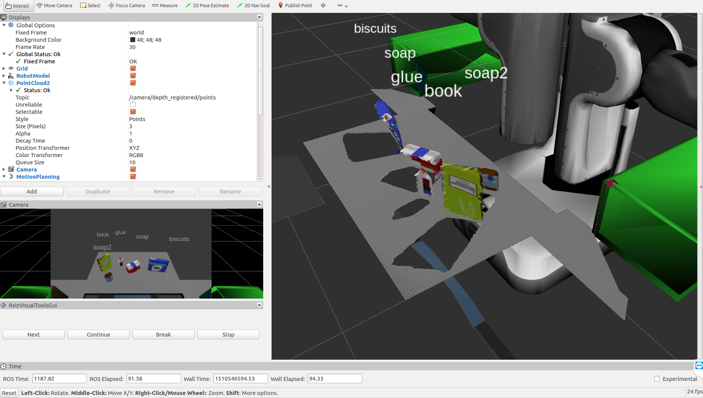
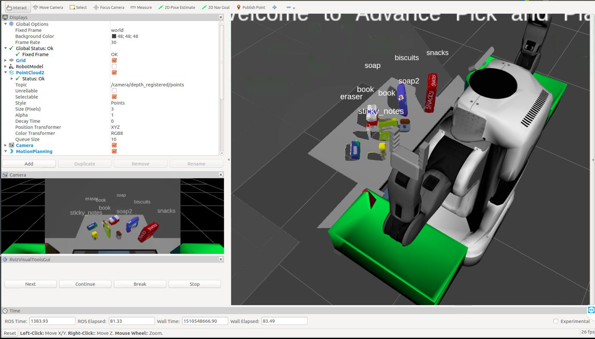

## Project: Perception Pick & Place
### This file documents the details of the Percption Project.

---

## Complete Exercise 1 steps. Pipeline for filtering and RANSAC plane fitting implemented.
#### 1. Extract features and train an SVM model on new objects (see `pick_list_*.yaml` in `/pr2_robot/config/` for the list of models you'll be trying to identify).  

There are three of `pick_list_*.yaml` files under `/pr2_robot/config/`, each of which contains a list of objects. There are two two files related to the feature extraction and SVM-training process.  

 - `catkin_ws/src/sensor_stick/scripts/capture_features.py` reads objects from the `model(line 25)` list and generates labeled features for each of them. The histograms and the corresponding labels are save in the `catkin_ws/training_set.sav` file. Another key point to be noticed is that, in the for loop, the number of samples for each object is determined by the number of loops. The more the samples extracted for a object, the more accurate the SVM will be. In the light of this statement, in order to improve the accuracy of the SVM, the number of loops is modified to 30 for each object.

 - `train_svm.py` firstly pickle-read the the features and labels of each objects from the `training_set.sav`and then trains a svm(support vector machine) on thees features and labels. The Sklearn module is employed to train the SVM. The training data is pre-processed with the help of numpy and is separate to training set and validation set. After that, the SVM is trained and pickle-saved to `model.sav`.

In the `capture_features.py`, different lists of objects can be selected by comment or uncomment the corresponding line.

The training results are show in the figure below.
 - For pick list 1  

 - For pick list 2  

 - For pick list 3  

#### 2. Write a ROS node and subscribe to `/pr2/world/points` topic. This topic contains noisy point cloud data that you must work with.  
1. Use `rospy.init_node` to initialize a new node
2. Use `rospy.Subscriber` to subscribe from the point cloud topic.

#### 3. Use filtering and RANSAC plane fitting to isolate the objects of interest from the rest of the scene.  

The call back function of the point cloud subscriber is  `pcl_callback()`. This function implements the main pipeline of object recognition. After converted to the pcl-format, the point cloud data is passed to the statistical outlier filter firstly. After that, the point cloud is fed to the Voxel Grid Downsampling filter, which down samples the point cloud data based on the resolution of voxel. The PassThrough Filter mainly cut out the the point cloud in a certain volume defined by x\y\z axis.  

The RANSAC plane fitting is used to identify the table by fitting it to a rectangular model. The table and objects can be separated afterward.  

The implementation of these filters is in the file of `project_template.py`.

#### 4. Apply Euclidean clustering to create separate clusters for individual items.
The DBSCAN Algorithm is employed here to separate the point cloud to different objects. The point cloud data with color informatoin is firstly passed to the XYZRGB_to_XYZ filter to drop the color information. Then the Euclidean Cluster is applied to the white-colored point cloud. After that, the clusters and there labels are published to ros topics for Rviz to visulize the point clouds.

#### 5. Perform object recognition on these objects and assign them labels (markers in RViz).  
The results are shown in the figures below.
 - For world 1  
 
 - For world 2   
 
 - For world 3  
 

#### 6. Calculate the centroid (average in x, y and z) of the set of points belonging to that each object.  
The object list is got from the ROS Parameter Server. The ground truth is compared with the predicted labels. If the true label matches with the prediction, the centroid of the corresponding object is calculated by the `np.mean()` function and appended to a list.  

#### 7. Create ROS messages containing the details of each object (name, pick_pose, etc.) and write these messages out to `.yaml` files, one for each of the 3 scenarios (`test1-3.world` in `/pr2_robot/worlds/`).  [See the example `output.yaml` for details on what the output should look like.](https://github.com/udacity/RoboND-Perception-Project/blob/master/pr2_robot/config/output.yaml)
As shown in the code.  

#### 8. Submit a link to your GitHub repo for the project or the Python code for your perception pipeline and your output `.yaml` files (3 `.yaml` files, one for each test world).  You must have correctly identified 100% of objects from `pick_list_1.yaml` for `test1.world`, 80% of items from `pick_list_2.yaml` for `test2.world` and 75% of items from `pick_list_3.yaml` in `test3.world`.
Github repo is created, and the project is pushed.   

#### 9. Congratulations!  Your Done!
