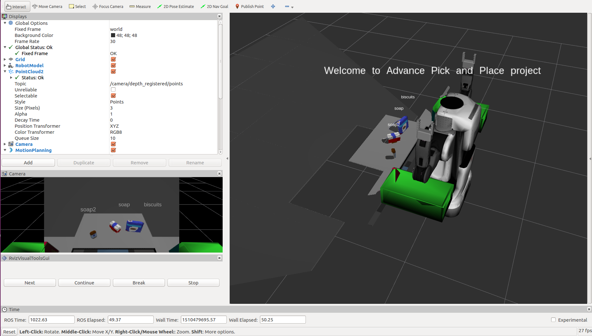

## Project: Perception Pick & Place
### This file documents the details of the Percption Project.

---

## Complete Exercise 1 steps. Pipeline for filtering and RANSAC plane fitting implemented.
#### 1. Extract features and train an SVM model on new objects (see `pick_list_*.yaml` in `/pr2_robot/config/` for the list of models you'll be trying to identify).  

There are three of `pick_list_*.yaml` files under `/pr2_robot/config/`, each of which contains a list of objects. There are two two files related to the feature extraction and SVM-training process.  

 - `catkin_ws/src/sensor_stick/scripts/capture_features.py` reads objects from the `model(line 25)` list and generates labeled features for each of them. The histograms and the corresponding labels are save in the `catkin_ws/training_set.sav` file. Another key point to be noticed is that, in the for loop, the number of samples for each object is determined by the number of loops. The more the samples extracted for a object, the more accurate the SVM will be. In the light of this statement, in order to improve the accuracy of the SVM, the number of loops is modified to 30 for each object.

 - `train_svm.py` firstly pickle-read the the features and labels of each objects from the `training_set.sav`and then trains a svm(support vector machine) on thees features and labels. The Sklearn module is employed to train the SVM. The training data is pre-processed with the help of numpy and is separate to training set and validation set. After that, the SVM is trained and pickle-saved to `model.sav`.

In the `capture_features.py`, different lists of objects can be selected by comment or uncomment the corresponding line.

The training results are show in the figure below.
 - For pick list 1  

 - For pick list 2  

 - For pick list 3  

#### 2. Write a ROS node and subscribe to `/pr2/world/points` topic. This topic contains noisy point cloud data that you must work with.  
1. Use `rospy.init_node` to initialize a new node
2. Use `rospy.Subscriber` to subscribe from the point cloud topic.

#### 3. Use filtering and RANSAC plane fitting to isolate the objects of interest from the rest of the scene.  

The call back function of the point cloud subscriber is  `pcl_callback()`. This function implements the main pipeline of object recognition. After converted to the pcl-format, the point cloud data is passed to the statistical outlier filter firstly. After that, the point cloud is fed to the Voxel Grid Downsampling filter, which down samples the point cloud data based on the resolution of voxel. The PassThrough Filter mainly cut out the the point cloud in a certain volume defined by x\y\z axis.  

The RANSAC plane fitting is used to identify the table by fitting it to a rectangular model. The table and objects can be separated afterward.  

The implementation of these filters is in the file of `project_template.py`.

#### 4. Apply Euclidean clustering to create separate clusters for individual items.
The DBSCAN Algorithm is employed here to separate the point cloud to different objects. The point cloud data with color informatoin is firstly passed to the XYZRGB_to_XYZ filter to drop the color information. Then the Euclidean Cluster is applied to the white-colored point cloud. After that, the clusters and there labels are published to ros topics for Rviz to visulize the point clouds.

#### 5. Perform object recognition on these objects and assign them labels (markers in RViz).  
The results are shown in the figures below.
 - For world 1  
 
 - For world 2   
 
 - For world 3  
 

#### 6. Calculate the centroid (average in x, y and z) of the set of points belonging to that each object.  
The object list is got from the ROS Parameter Server. 

#### 7. Create ROS messages containing the details of each object (name, pick_pose, etc.) and write these messages out to `.yaml` files, one for each of the 3 scenarios (`test1-3.world` in `/pr2_robot/worlds/`).  [See the example `output.yaml` for details on what the output should look like.](https://github.com/udacity/RoboND-Perception-Project/blob/master/pr2_robot/config/output.yaml)  

#### 8. Submit a link to your GitHub repo for the project or the Python code for your perception pipeline and your output `.yaml` files (3 `.yaml` files, one for each test world).  You must have correctly identified 100% of objects from `pick_list_1.yaml` for `test1.world`, 80% of items from `pick_list_2.yaml` for `test2.world` and 75% of items from `pick_list_3.yaml` in `test3.world`.

#### 9. Congratulations!  Your Done!

# Extra Challenges: Complete the Pick & Place
7. To create a collision map, publish a point cloud to the `/pr2/3d_map/points` topic and make sure you change the `point_cloud_topic` to `/pr2/3d_map/points` in `sensors.yaml` in the `/pr2_robot/config/` directory. This topic is read by Moveit!, which uses this point cloud input to generate a collision map, allowing the robot to plan its trajectory.  Keep in mind that later when you go to pick up an object, you must first remove it from this point cloud so it is removed from the collision map!
8. Rotate the robot to generate collision map of table sides. This can be accomplished by publishing joint angle value(in radians) to `/pr2/world_joint_controller/command`
9. Rotate the robot back to its original state.
10. Create a ROS Client for the “pick_place_routine” rosservice.  In the required steps above, you already created the messages you need to use this service. Checkout the [PickPlace.srv](https://github.com/udacity/RoboND-Perception-Project/tree/master/pr2_robot/srv) file to find out what arguments you must pass to this service.
11. If everything was done correctly, when you pass the appropriate messages to the `pick_place_routine` service, the selected arm will perform pick and place operation and display trajectory in the RViz window
12. Place all the objects from your pick list in their respective dropoff box and you have completed the challenge!
13. Looking for a bigger challenge?  Load up the `challenge.world` scenario and see if you can get your perception pipeline working there!

## [Rubric](https://review.udacity.com/#!/rubrics/1067/view) Points
### Here I will consider the rubric points individually and describe how I addressed each point in my implementation.  

---
### Writeup / README

#### 1. Provide a Writeup / README that includes all the rubric points and how you addressed each one.  You can submit your writeup as markdown or pdf.  

You're reading it!

### Exercise 1, 2 and 3 pipeline implemented
#### 1. Complete Exercise 1 steps. Pipeline for filtering and RANSAC plane fitting implemented.

#### 2. Complete Exercise 2 steps: Pipeline including clustering for segmentation implemented.  

#### 2. Complete Exercise 3 Steps.  Features extracted and SVM trained.  Object recognition implemented.
Here is an example of how to include an image in your writeup.

### Pick and Place Setup

#### 1. For all three tabletop setups (`test*.world`), perform object recognition, then read in respective pick list (`pick_list_*.yaml`). Next construct the messages that would comprise a valid `PickPlace` request output them to `.yaml` format.

And here's another image!

Spend some time at the end to discuss your code, what techniques you used, what worked and why, where the implementation might fail and how you might improve it if you were going to pursue this project further.  
